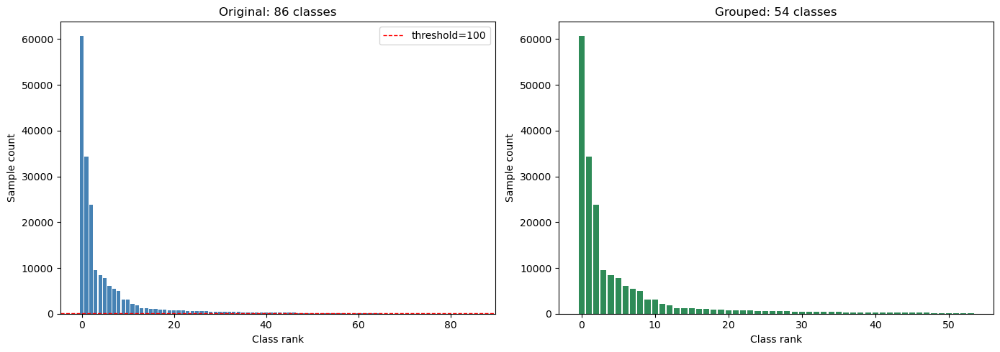

#Important note for later
- Limitations:
It is impossible to train the model to recognize and assign some DDI because of lack of data. These interactions, quantified as those with <100 D-D samples, are grouped together and labeled as 'Other' by the model. Unfortunately, many of these interactions are severe. So as always, trust a educated professional. Ask your pharmacist. 
 -- INSERT IMAGE OF THE CHART HERE