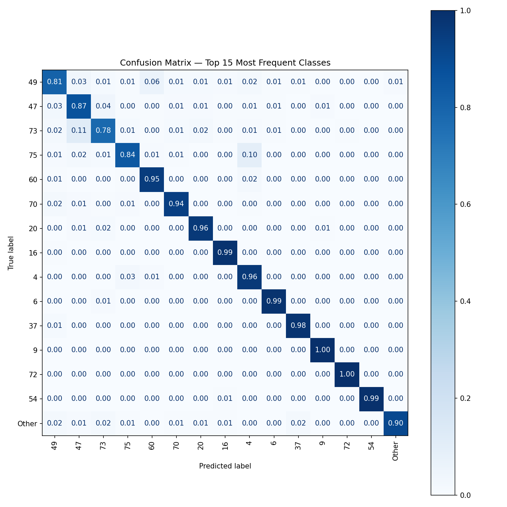

# DDI Predictor

Predicts the specific type of interaction between two drugs — not just whether one exists — using molecular structure and gradient-boosted trees, with per-prediction explainability.



## What it does

Given two drug names, the model predicts which of 54 clinically distinct interaction types is most likely between them (e.g. *"may increase the anticoagulant activities of"*), along with the underlying fingerprint features driving that prediction, via SHAP-style attribution.

Try it: [live demo link — add once deployed to Hugging Face Spaces]

## Why multiclass, not binary

Most DDI classifier projects predict a simple yes/no interaction flag. This one predicts the interaction *mechanism* instead — a more clinically useful signal, and a better showcase of both ML engineering and domain understanding. The dataset (TDC's DrugBank benchmark, 191,808 pairs) is natively labeled with 86 distinct interaction types; after merging classes with fewer than 100 samples into a single `Other` bucket, this became a 54-class problem.

## Architecture
- **Features**: Morgan fingerprints (radius 2, 2048 bits per drug, concatenated to 4096 dimensions)
- **Model**: XGBoost, `multi:softprob`, `tree_method='hist'`, early stopping, balanced sample weighting
- **Explainability**: XGBoost's native `pred_contribs` (Tree SHAP under the hood) rather than the `shap` library's `TreeExplainer` — at 54 classes, `TreeExplainer` was too slow for real-time serving; native contributions are mathematically equivalent but fast enough for a live app
- **Translation**: raw class labels are template sentences with `#Drug1`/`#Drug2` placeholders (e.g. *"#Drug1 may increase the anticoagulant activities of #Drug2"*) — `predict.py` maps the predicted class to its sentence and substitutes in the real drug names before returning a result
- **Serving**: FastAPI backend + Streamlit frontend, sharing one prediction module (`src/predict.py`) so there's no duplicated logic between the two interfaces

## Results

| Metric | Score |
|---|---|
| Macro F1 | 0.869 |
| Micro F1 | 0.849 |

Macro F1 is the headline metric — it weights every class equally regardless of size, which matters given the dataset's long tail (the three largest classes account for ~62% of all pairs).

Macro F1 slightly *exceeding* Micro F1 here is worth noting, since it's the less common pattern — for an imbalanced problem, rare classes usually perform worse and pull the macro average down below accuracy (Micro F1). The likely explanation is the balanced sample weighting used during training (`class_weight='balanced'`), which explicitly treats every class as equally important regardless of size. That appears to trade some performance on the three dominant classes — which control Micro F1, since it's equivalent to overall accuracy — for stronger performance across the 53-class long tail, which is what Macro F1 rewards. Full per-class precision/recall/F1 breakdown is printed by `evaluate_model()` in `03_model_training.ipynb`; confusion matrix in `models/confusion_matrix.png`.

## Running locally

```bash
git clone https://github.com/daniel-broadhead/ddi-predictor
cd ddi-predictor
conda create -n ddi-env python=3.10
conda activate ddi-env
conda install -c conda-forge rdkit
pip install -r requirements.txt
```

```bash
# FastAPI backend
uvicorn app.api:app --reload

# Streamlit frontend (separate terminal)
streamlit run app/streamlit_app.py
```

**Notes:**
- `requirements.txt` pins `numpy<2` (RDKit's conda build predates NumPy 2.x's breaking ABI change) and `PyTDC==0.4.1` (newer releases pull in an unrelated single-cell genomics dependency, `tiledbsoma`, that fails to build on Windows).
- `.streamlit/config.toml` sets `headless = true` and is committed to the repo — this avoids a Windows-specific issue where Streamlit's automatic browser-launch step can silently kill the server right after startup.
- Trained model artifacts (`models/*.joblib`) aren't committed to this
repo. To generate them, run notebooks `01` through `03` in order after
installing dependencies — `03_model_training.ipynb` produces `ddi_xgb.joblib`
and `label_encoder.joblib`. Expect the XGBoost training cell to take significant
time on CPU (~80 minutes in development).

## Project structure

```
DDI_Project/
├── app/
│   ├── api.py                FastAPI backend
│   └── streamlit_app.py      Streamlit frontend
├── src/
│   ├── features.py           SMILES → Morgan fingerprint conversion
│   ├── model.py               Training, evaluation, and class-grouping functions
│   ├── explain.py             Per-prediction explanation (native XGBoost contributions)
│   ├── predict.py             Shared prediction pipeline used by both app/ interfaces
│   └── drug_lookup.json       Drug name → SMILES lookup
├── models/                    Trained model, label encoder, translations, evaluation charts
├── notebooks/
│   ├── 01_data_exploration.ipynb      Load, explore, group rare classes into 54
│   ├── 02_feature_engineering.ipynb   SMILES → Morgan fingerprints
│   ├── 03_model_training.ipynb        Train RF baseline + XGBoost, evaluate, save model
│   ├── 04_explainability.ipynb        Native SHAP-style explanations, translation dictionary
│   └── 05_app_testing.ipynb           Drug lookup + end-to-end pipeline test
├── data/                      Raw dataset + cached fingerprints (gitignored)
├── requirements.txt
├── LICENSE.md
└── README.md
```

## Limitations & future work

- **The `Other` class isn't a real pharmacological category.** It's a statistical necessity — 33 interaction types with fewer than 100 training samples each, merged so the model and evaluation would be viable. Some of the individually-rare types folded into `Other` may be clinically significant despite being data-poor. **This tool does not replace professional medical or pharmacist guidance, especially for any interaction the model places in the `Other` category.**
- **Drug name lookup is currently limited to 9 well-known drugs**, resolved via PubChem as a temporary stand-in. A full 1,706-drug lookup (joining DrugBank's vocabulary export against this dataset's SMILES) is in progress, pending DrugBank's academic download access coming back online.
- Future feature: map top contributing fingerprint bits back to actual molecular substructures (partially built in `notebooks/`, not yet wired into the live app).

## License

MIT — see `LICENSE`.